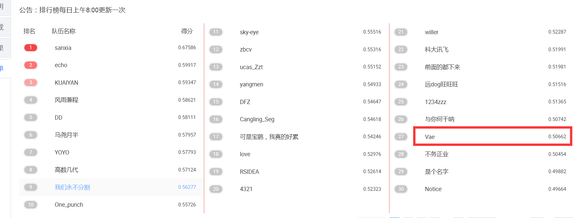
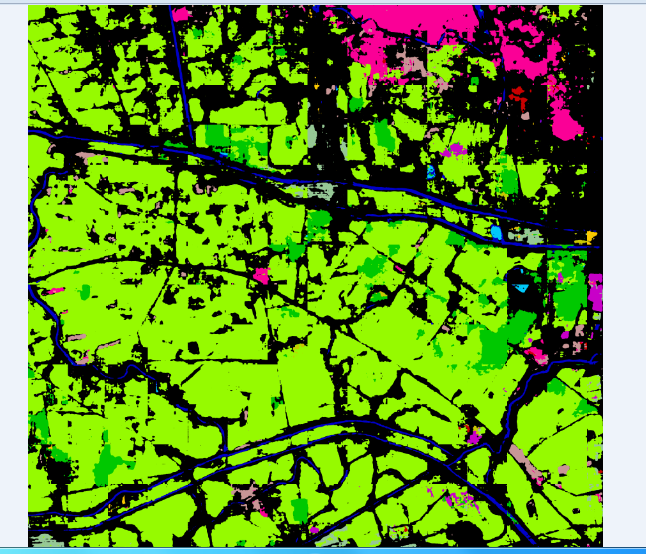

# semantic_segmentation_contest_deeplabv3
遥感图像稀疏表征与智能分析竞赛之语义分割。晃晃悠悠比赛就结束了，因为是第一次参加自己方向
上的比赛，主要是通过这个比赛学习和巩固语义分割的知识，同时也为随后的比赛增加经验。所有的
代码都已经整理上传。
最后的结果：（仅仅只用了deeplabv3 + dropout）第27名。
## 结果

|       |Method                                | OS  | kappa       |
|:-----:|:------------------------------------:|:---:|:----------:|
| repo  | MG(1,2,4)+ASPP(6,12,18)+Image Pooling|16   | **50.662%** |

图片结果：

      

  

总结：
    第一步：做数据集（1000*1000）。（这期间出现了问题，我们使用cv2读取的RGB通道数据，取得了最好的成绩。但是cv2读取不了红外通道数据，然后我们换成libtiff
    读取数据时，发现libtif数据的RGB数据与cv2不一样，然后我们使用libtiff的RGB跑出的结果又没有cv2的RGB数据高。最后我们由于时间的关系，只使用cv2的RGB数据）
    第二步：选择网络，最开始我们使用unet,效果不好，后来就直接使用deeplabv3了，后来又用了v3+, DA的模块，pspnet, aaf等。
    效果都不太好，deeplabv3效果是最好的。
    第三步：测试，我们只使用了一个1000*1000留下其中400*400的结果。
    使用滚动引导滤波先预处理图像。（由于时间关系还没有做）